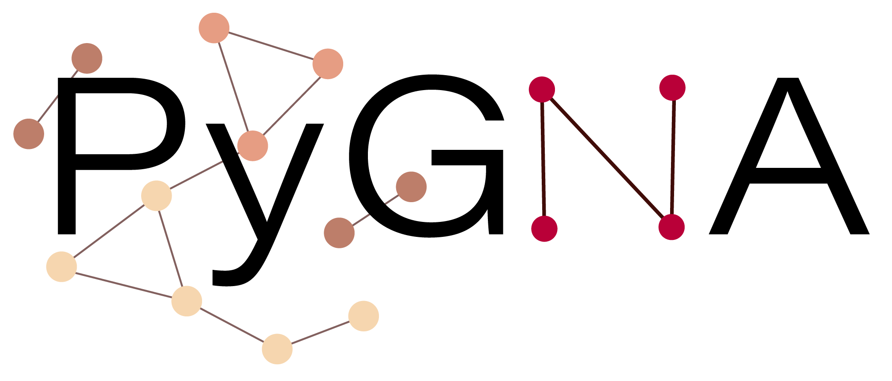

## Publications
 * Fanfani, Viola, et al. ‘The landscape of the heritable cancer genome‘. Cancer Research, 2021. https://cancerres.aacrjournals.org/content/early/2021/03/12/0008-5472.CAN-20-3348
 * Fanfani, Viola, et al. _‘PyGNA: a unified framework for geneset network analysis.‘_ BMC Bioinformatics, 2020. doi: [https://doi.org/10.1186/s12859-020-03801-1](https://bmcbioinformatics.biomedcentral.com/articles/10.1186/s12859-020-03801-1)
 * Fanfani, Viola, et al. _‘Dissecting the heritable risk of breast cancer: from statistical methods to susceptibility genes.‘_ Seminars in Cancer Biology. Academic Press, 2020. doi: [https://doi.org/10.1016/j.semcancer.2020.06.001](https://doi.org/10.1016/j.semcancer.2020.06.001)
 * Draberova, Helena, et al. _‘Systematic analysis of the IL‐17 receptor signalosome reveals a robust regulatory feedback loop.’_ The EMBO Journal (2020): e104202. doi: [https://doi.org/10.15252/embj.2019104202](https://doi.org/10.15252/embj.2019104202)
 * Fanfani, V.  Citi, L., Harris, AL, Pezzella, F. and Stracquadanio, G. _‘Gene-level heritability analysis explains the polygenic architecture of cancer’_. bioRxiv, 2019, doi: 10.1101/599753

## Conferences
 * 2021, __"Network Biology"__ virtual meeting, CSHL, US. _Poster Presentation_: “Interpretable graph neural networks unveil system‑levelreprogramming in cancer”.
 * 2020, __"The Biology of Genomes"__, virtual meeting, CSHL, US. _Poster Presentation_: "Decoding cancer risk in the broader population with gene-level heritability".
 * 2019, __Genes and Cancer Meeting__, Cambridge, UK. _Selected flash talk_: "Dissecting cancer heritability in European populations".  
 * 2018, __From functional genomics to system biology__, EMBL, Heidelberg, DL. _Poster presentation_: "Geneset Network Analysis: understanding high-throughput genomic data using the interactome".  
 * 2018, __BACR Students Conference__.  _Poster presentation_: “A new geneset analysis approach to identify and characterise cancer pathways”    

## Recent Talks

 * __2019 – SynthSys, University of Edinburgh__ , “Cancer heritability, decoding the contribution of high frequency variants to cancer risk”. 
            

# Projects

On GitHub you can see all the projects I am working on. Most of them are hosted on the 
 [lab's group](https://github.com/stracquadaniolab "Github").

###  
 
The Bayesian Gene Heritability Analysis software ([BAGHERA](https://github.com/stracquadaniolab/baghera "BAGHERA")) estimates the contribution to the heritability of a trait/disease of all the SNPs in the genome (genome-wide heritability) and those nearby protein-coding genes (gene-level heritability).

Documentation can be found [here](https://baghera.readthedocs.io/en/latest/ "Baghera").

###  
 
[PyGNA](https://github.com/stracquadaniolab/pygna "PyGNA") is a unified framework for network analysis of high-throughput experiment results. It can be used both as a standalone command line application or it can be included as a package in your own python code.

Pygna has now been published in BMC Bioinformatics! [https://doi.org/10.1186/s12859-020-03801-1](https://doi.org/10.1186/s12859-020-03801-1)

Documentation can be found [here](https://pygna.readthedocs.io/en/latest/ "Pygna").
